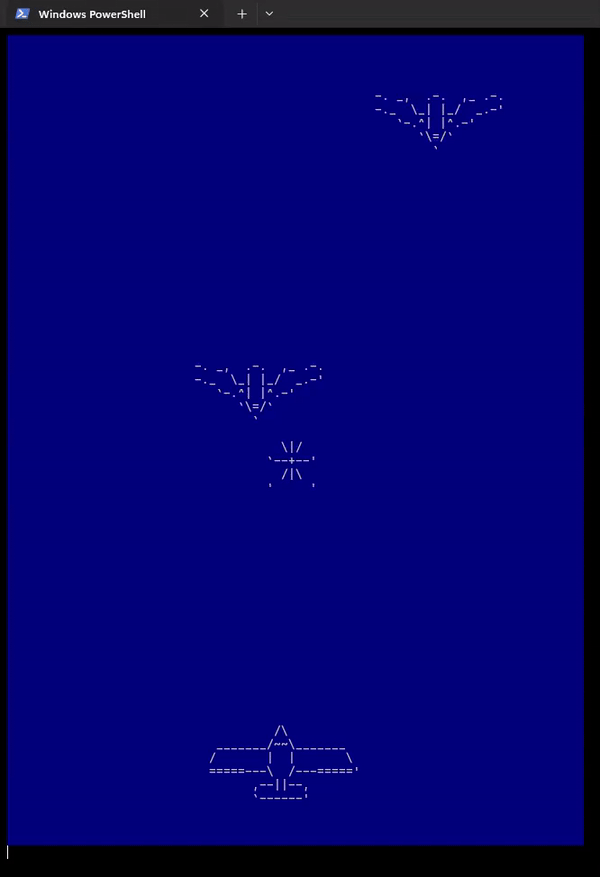

# OOP Space Shooter Game rendered in terminal 

## Overview

This is a Python-based terminal game inspired by classic arcade-style space shooter games. Players control a plane to fight against waves of enemy planes and bullets. The game features a simple interface with sprite-based rendering and offers functionalities like collision detection, destroyable objects, and win/lose states.

## Requirements

- Python 3.9
- `colorama` library for terminal color handling
- `pynput` library for keyboard input

Install the dependencies using:
```bash
pip install colorama pynput
```

---

## How to Play

1. **Run the Game**  
   Start the game by running the main script:
   ```bash
   python main.py
   ```
   
2. **Controls**  
   Use the following keys for movement and shooting:
   - **W**: Move up
   - **S**: Move down
   - **A**: Move left
   - **D**: Move right

3. **Objective**  
   Defeat all enemy planes to win the game. Avoid getting hit by enemy bullets or colliding with enemies to prevent losing.

---
